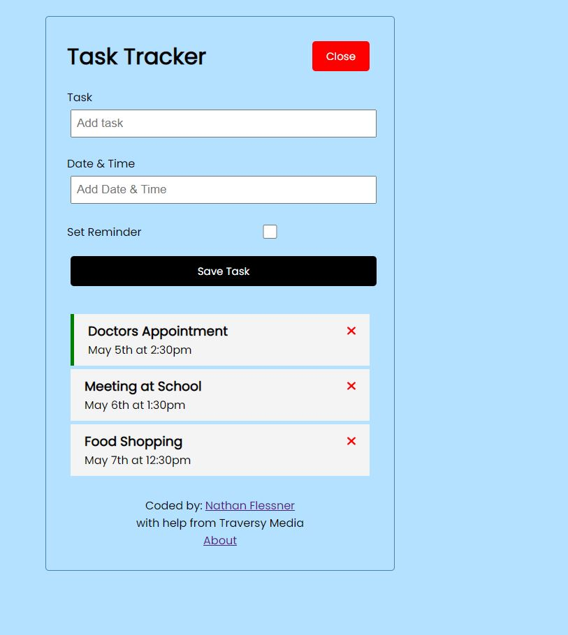

# TraversyMediaAngular Tracker App



## Table of Contents

- [Overview](#overview)
- [Technologies](#technologies)
- [Questions](#questions)

## Overview
This was a quick application I built using the Traversy Media Angular Crash Course Youtube <a href="https://www.youtube.com/watch?v=3dHNOWTI7H8" target="_blank">video.<a/> It was very knowledgable and helped to solidify the Angular codebase structure and how to use the CLI. 

## Technologies
- Angular 13.3
- JSON Server
- RxJS
- FontAwesome


## Questions

If you have any questions please feel free to reach out to me at [Github](https://github.com/SirNathanJF) or through email at <nathanflessner@gmail.com>. If you would like to use my source code please fork the repository. Locally you will need to ```npm install``` or ```yarn install``` and use ```npm start``` or ```yarn start```. ```ng serve``` also works. Please note that in order to display the tasks to the page you will need to also run ```npm run server``` to start the local "API". Enjoy!
